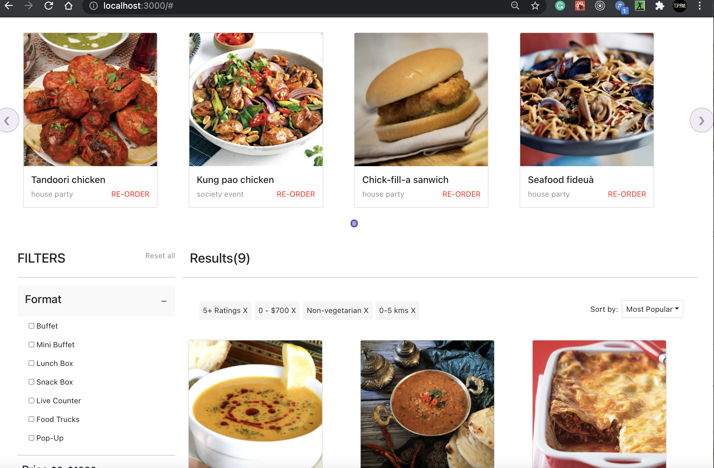
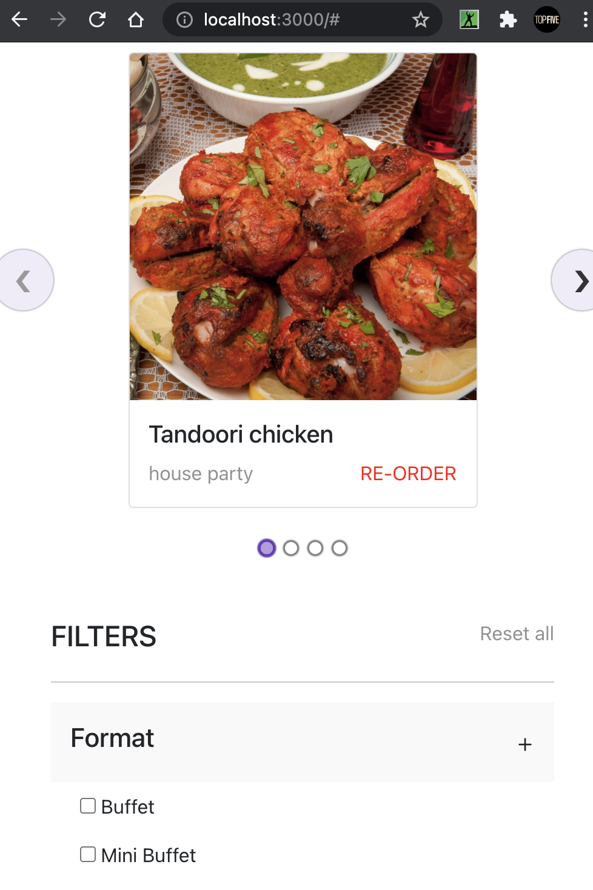
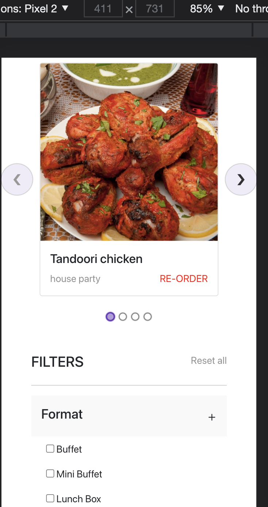

# PERN RESTAURANT APP

It is a restaurant website made in React.js, Node.js, PostgreSQL. There is not much functionality. The meal items data has been fetched from the PostgreSQL database.

Meal items data has been manually inserted into the PostgreSQL database locally. More emphasis has been given to the design part of the React Js, which has been done using Bootstrap and Styled components.

## Table of contents

- [Overview](#overview)
  - [Screenshot](#screenshot)
  - [Links](#links)
- [My process](#my-process)
  - [Built with](#built-with)
  - [What I learned](#what-i-learned)
  - [Useful resources](#useful-resources)
- [Author](#author)
- [Acknowledgments](#acknowledgments)

## Overview

You need to clone the GitHub repository and then create a local PostgreSQL database with a table. The database should be named as 'mealshop'. The table should be named as 'meals'. Insert all the mock data given in the mock.sql file, which is present in the server folder.

In db.js, which is present in the server folder, replace your username and password of the local PostgreSQL database.

Then on the terminal, inside the server folder, run

```
nodemon index.js
```

and then on a new terminal, inside the client folder, run

```
npm install
```

and then

```
npm start
```

### Screenshot

- Full-Screen laptop size
  
- Small Screen laptop size
  
- iPhone Screen size
  

### Links

- Live Video Overview: [Live Video](https://drive.google.com/file/d/19os89U4DFy0NOuSokBcN4E1cCamUgNPv/view?usp=sharing)

## My process

First, I designed the PostgreSQL database and connect it with the Express framework. I upload all the data in the database with SQL commands in the terminal. I tested the API using Postman.

After that, I created the front end using ReactJS. Data from the PostgreSQL database has been parsed using FETCH API. Then, I styled all the UI components.

### Built with

- PostgreSQL
- Express
- ReactJs
- NodeJs

### What I learned

I got to learn how to upload and fetch data to and from the PostgreSQL database.

```js
app.get("/meals", async (req, res) => {
  try {
    const allMeals = await pool.query("SELECT * FROM meals");
    res.json(allMeals.rows);
  } catch (err) {
    console.log(err.message);
  }
});

const getMeals = async () => {
  try {
    const response = await fetch("http://localhost:5000/meals");
    const data = await response.json();
    setMeals(data);
  } catch (error) {
    console.log(error.message);
  }
};
```

## Author

- LinkedIn - [Khaidem Sandip Singha ](https://www.linkedin.com/in/khaidemsandip/)
- Twitter - [@KurosakiCoder](https://twitter.com/KurosakiCoder)
